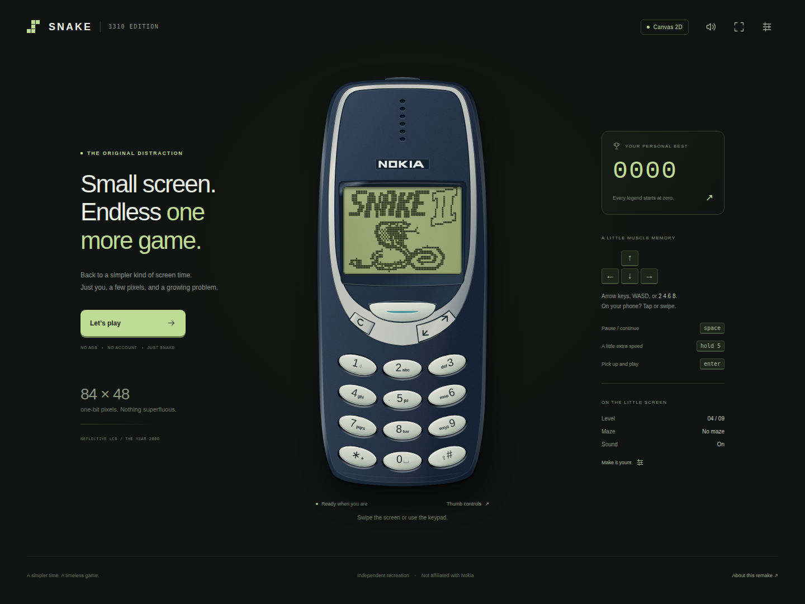

# Snake · 3310 Edition

A complete, dependency-free HTML/JavaScript Snake II recreation with a reference-reconstructed Nokia 3310 handset, an 84 × 48 one-bit framebuffer, and a WebGPU reflective-LCD renderer. A matching Canvas 2D renderer keeps the same game playable when WebGPU is unavailable.

**[Play on GitHub Pages](https://wieslawsoltes.github.io/Snake/)** · **[Fidelity notes](docs/FIDELITY.md)** · **[Validation](docs/VALIDATION.md)**



## Handset and LCD

Version 2 replaces the stylized first-edition phone with an editable 480 × 1130 vector reconstruction: narrow navy housing, silver horseshoe surround, six vertically arranged receiver apertures, inset lens, Nokia plaque, cyan Navi stripe, C key, diagonal scroll rocker, and individually bowed numeric rows. Physical key artwork stays separate from semantic buttons and enlarged touch hit targets.

The LCD projects 84 × 48 logical elements through an approximately 30:22 aperture, producing rectangular physical cells instead of square monitor pixels. The model includes electrode gaps, asymmetric liquid-crystal response, displaced pixel shadows, an olive-gray reflective substrate, static polarizer grain, lens reflections, uneven green edge illumination, and viewing-angle contrast. Daylight, backlit, and dark-room presets adjust both the display and handset illumination.

This is a **clean-room visual reconstruction**, not firmware emulation, a scanned production CAD model, or laboratory calibration against a particular original panel. Artwork, typography, maze layouts, sounds, and response constants are reconstructed. Nokia trademarks identify the recreated device; the project is not affiliated with Nokia. [FIDELITY.md](docs/FIDELITY.md) records the reference and measurement boundary.

## Run and build

Development tools require Node.js 22 or newer. The shipped game has no runtime dependencies and needs no package installation.

```sh
npm start
# Open http://localhost:8080

npm test
npm run build
# dist/ is the complete static site.
# snake-3310.html is the self-contained single-file edition.
```

The standalone HTML opens directly on a desktop. Host `dist/` over HTTPS for mobile/PWA use. WebGPU needs a secure context and an available browser adapter; initialization failure or device loss automatically selects Canvas 2D. Relative paths support the `/Snake/` project-site prefix.

## Play

Enter or the Navi key starts the game. Steer with arrows, WASD, 2/4/6/8, keypad taps, or LCD swipes. Space/0 pauses; holding 5 enables the optional boost. C/Escape goes back. The two rocker regions navigate LCD menus. The top power key toggles backlighting.

Touch is handled on pointer-down. Pointer capture/cancellation releases held controls, and a bounded two-turn queue preserves rapid corners without allowing an immediate reverse. Numeric hit targets are at least 44 × 44 CSS pixels in the tested mobile handset layout. Optional thumb controls sit outside the phone, and focus mode provides a landscape-friendly layout.

Gameplay includes nine speeds, a wraparound field, five alternative wall layouts, food, timed bonuses, growth, wall/self collision, pause/continue, restart confirmation, high scores, saved runs, and a full-board win. Saves restore paused. Window interruption and page lifecycle transitions pause play and clear held inputs.

## Appearance settings

Daylight disables the backlight for the reflective gray-green appearance. Backlit adds green illumination and lit legends. Dark room reduces ambient illumination on the case and LCD. Additional controls expose ambient light (5–100%), viewing angle (−45° to +45°), contrast, response persistence, electrode gaps, and glass reflection. Viewing angle changes optical contrast; it does not geometrically rotate the phone. Audio and haptics are optional.

## Architecture

`src/engine.js` is independent of the DOM and rendering. It uses a bounded typed-array body ring, occupancy map, deterministic random state, fixed simulation steps, validated snapshots, and explicit growth/collision semantics.

`src/lcd.js`, `src/font.js`, and `src/artwork.js` rasterize authored title artwork, glyphs, and menus into exactly 4,032 binary cells. Anti-aliasing occurs in physical-screen projection, not in the logical game image.

`src/renderer.js` uploads binary targets to GPU storage. A compute shader evolves persistent pixel charge; a fragment shader performs the optical projection. The CPU implementation follows the same equations/constants in `src/optics.js`. Its static surface, aperture, and pixel-index tables are cached; ordinary frames reuse buffers and run linear charge/RGBA loops. Rendering stops after the response settles.

An opt-in GPU texture export provides deterministic RGBA output with 256-byte-aligned readback rows. It is used for native shader regression tests. The interactive GPU path renders directly to the swap chain and never pays this readback synchronization cost.

`src/app.js` handles UI state, focus, accessibility announcements, lifecycle, input, settings, and invalidation. `src/storage.js` validates persisted data and preserves version-1 saves. `src/audio.js` synthesizes tones after a gesture. `assets/handset.svg` is the editable vector master; matching paths are inlined in the HTML for exact hit-area alignment and portable export.

The hosted service worker caches a coherent application shell. Distribution builds derive its cache identity from runtime-asset hashes, so changed modules produce a new worker/cache. Existing clients keep their installed HTML/module graph until the new worker activates.

## Tests and delivery

```sh
npm test
npm run build
python -m pip install -r requirements-dev.txt
python -m playwright install --with-deps chromium
node tools/serve.mjs dist 8080
# Separate terminal:
python tests/browser.py
python tests/fidelity.py
python tests/hosted.py
python tools/package.py
```

Linux CI runs headed Chromium through Xvfb. The hosted suite executes the production WGSL compute and fragment shaders with SwiftShader, renders to a private texture, and compares exported pixels against Canvas. UI presentation is tested separately with the production Canvas fallback because the software CI compositor cannot reliably present a WebGPU swap chain. This is not a hardware-GPU benchmark or physical-device certification. `python tests/browser.py --headed --require-webgpu` retains stricter presentation acceptance for a representative GPU-enabled host.

On a navigation-restricted host, `--fixture` is available for the browser and fidelity suites. It uses explicitly labeled fixture storage and does not establish origin storage, native GPU, service-worker, or offline behavior. The hosted suite intentionally has no fixture mode.

The Pages workflow gates publication on all validation suites, commits generated delivery files/evidence on main, uploads the full source ZIP, publishes `dist/`, and verifies the deployed commit plus the SHA-256 and byte length of every public asset. Pages control dotfiles are excluded from the public manifest. Reports and screenshots are in `docs/` and workflow artifacts.

The package contains source, the standalone HTML, deployable site, tests, vector artwork, screenshots, reports, and workflow. It excludes Git internals, dependencies, and caches.

For diagnostics append `?debug&nosw`. `window.__snake.inspect()` is available only in debug mode. Append `?renderer=canvas` to force CPU projection.

## License

Code and authored graphics are distributed under the [MIT license](LICENSE), with the trademark clarification above. No Nokia firmware, extracted ROM artwork, photographed product texture, or third-party font is bundled. Primary references are documented in [FIDELITY.md](docs/FIDELITY.md).
